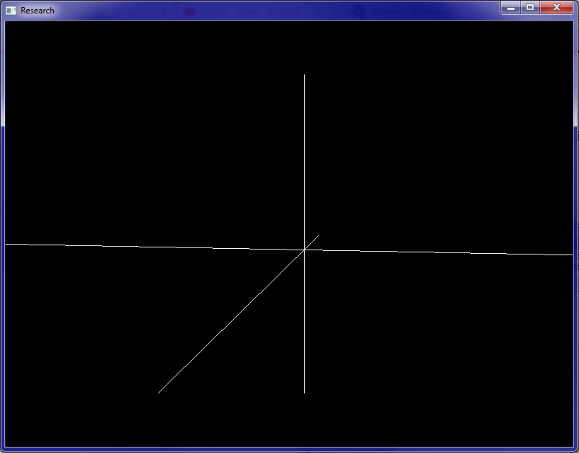

# BlueEngine
Graphic engine using OpenGL library in version 4.6.0.

## Description

It is graphic engine implementation using OpenGL library, according to my
 idea and project. In this version, there are available following modules:
1. Template class representing bitfield for particular usages. The class can
't afford for operations on bitfield values that belongs to different usage
 groups. The class also provides auto-incrementation in particular usage group.
1. Classes representing algebra and analytic geometry beings:
    1. Template class for matrix. A matrix can be created for different
     number types and makes it possible for operating with other instances
      (addition, subtraction and multiplication).
    1. Classes representing 3D points, vectors, planes, lines and triangle
     sequences. Each class has right constructor and operations on other types.
1. A class representing a color of particular pixel.
1. Main class of BlueEngine - Engine. This is root class that connects all
 main modules. For this moment the GraphicEngine class is only connected.
1. A class of GraphicEngine. This class represents graphic engine and connects
 with all components included in engine: VideoOutputWindow, ViewManager and
  origin of whole scene - CoordinateSystem.
1. A class of ViewManager. This class is responsible for performing view of
 currently selected camera - one of all registered cameras.
1. Classes representing scene objects (BaseObjectClass is a root class):
    1. Camera - is used to perform particular view of scene for user.
    1. Coordinate System - is used mainly as main origin of whole scene.
    1. Advanced Coordinate System - is used as pretty version of Coordinate
     System.
   In engine a objects hierarchy is used: position and rotation of objects is
    dependent on their's parent objects.
1. A class of VideoOutputWindow. This class places prepared view from
 ViewManager into application window.

## Running example demonstrational program

To run example program, is needed to copy built BlueEngine library
 (represented by libBlueEngine.dll) and other libraries from root directories:
* libgcc_s_seh-1.dll
* libstdc++-6.dll
* libwinpthread-1.dll

Program present view from rotating camera. In the view user can see main
 coordinate system of scene.
 
 
 <i>Screenshot of application window after start.</i>

## Supported operating systems

So far, the project has been compiled only on Microsoft Windows, but OpenGL
 in theory is also supported in Linux distribution.

## Dependencies

To compile this project, is needed to install the newest version of MinGW for
 64-bit architecture. The variant of POSIX thread library was selected during
  MinGW installation, so is recommended.
  
Also must be available following dynamic-link libraries:
* OpenGL32
* GLu32
* Any GLut library (also freeglut)
